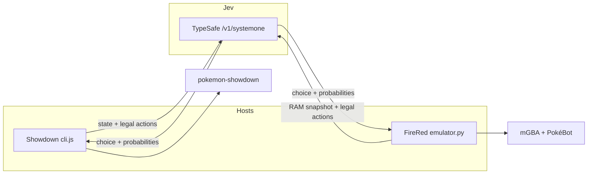

# How this is wired

Two fronts, one decision. Showdown and the FireRed ROM both build a state object, ask Jev the same question, and only then press a button or submit a command.



Jev never sees pixels. The dashboard JPEG is for you.

## A single turn

1. The host waits until the battle wants a decision (a move, or a replacement).
2. It lists only the legal options. Disabled moves and fainted teammates stay off the list.
3. It packs what Jev is allowed to know: both actives, HP, types, stats, moves, PP, party, weather, a short event tail. The ROM path may add a damage range from PokéBot's calculator.
4. One HTTP call, model `jev-1.13.0`, a [`choice`](https://docs.typesafe.ai/primitives/choice.md) question.
5. The answer has to name a real option, come with a full probability distribution, and a confidence in `[0, 1]`. Anything else ends the run.
6. Showdown gets `move 2` or `switch 4`. FireRed gets button presses through PokéBot's battle menu, then a personality check so the Pokémon that walked out is the one Jev named.

The baseline agent skips step 4 and picks the strongest-looking damage roll. Useful for wiring tests. Boring to watch.

## Showdown path

`cli.js` → `battle.js` → `jev.js`.

- Format is `gen3customgame`. Physical and special follow type, like Gen 3.
- Opponents are presets in `teams.js`. Species and levels match the first FireRed league. The opposing policy is a local damage heuristic, not the cartridge AI.
- Each trainer starts from a full heal. `--opponent all` is five separate matches.
- Logs go to `runs/`. The `.input.log` files replay in Showdown's own tools.

## FireRed path

`dashboard-service.sh` → `emulator.sh` → `emulator.py` + `emulator_web.py` + `dashboard.html`.

- ROM: FireRed USA v1.1 only, filename `Pokemon - Fire Red Version (U) (V1.1).gba`.
- `setup_emulator.py` pins [PokéBot Gen3](https://github.com/40Cakes/pokebot-gen3) at `5dd898f` and [libmgba-py 0.2.0](https://github.com/hanzi/libmgba-py) for macOS arm64.
- `--prepare` flies a throwaway party to Lorelei's room and writes `emulator-data/league.state`. Later fights reload that checkpoint and rewrite your configured team into RAM.
- Trainer IDs: Lorelei 410, Bruno 411, Agatha 412, Lance 413, Champion 440. Auto-advance walks that list after a win and stops on a loss.
- Switches wait for a stable party menu, then match `personality_value`. See `AGENTS.md`. Old slot numbers from before the menu opened are wrong.

The dashboard binds to `127.0.0.1:8765`. It serves the live frame, the last request/response (key stripped), and replay MP4s. It does not serve the ROM.

## Where to change things

| Want | Touch |
| --- | --- |
| A different party | `emulator-config.json` or the dashboard, `teams.js` for Showdown |
| A different question | the `instructions` string in `jev.js` and `JevStrategy.choose` |
| A new trainer preset | `teams.js`, plus `TRAINERS` in `emulator.py` if it is a ROM fight |
| Stricter validation | `validateAnswer` in `jev.js` and the matching block in `emulator.py` |
| Headless ROM fight | `./emulator.sh --run --opponent bruno --speed 4` |

## Files

```
cli.js / battle.js / jev.js / teams.js   text battles
emulator.py                              ROM session + Jev strategy
emulator_web.py / dashboard.html         local UI and replays
setup_emulator.py / emulator.sh          install + launch
emulator-config.json                     default level-40 team
```
