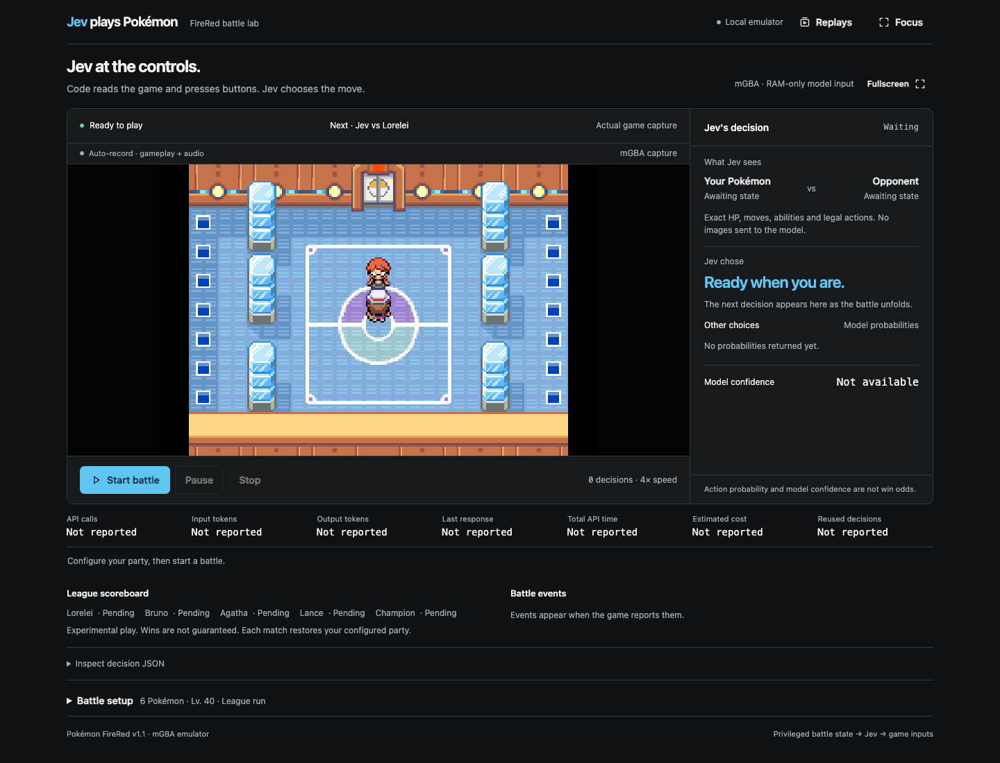
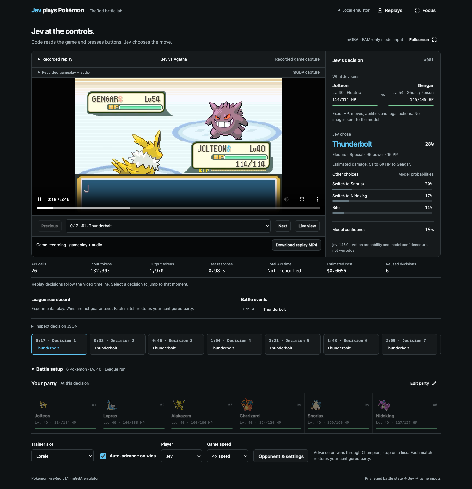

# Jev plays Pokémon


I wanted to see how [Jev](https://docs.typesafe.ai/models.md) plays Pokémon.

Not a screenshot agent. Not a bot that mashes A. I wanted to know if it could look at a real FireRed fight the way a player does: HP, types, moves, stats, the other team's roster, and then pick something that makes sense.


So I pointed it at the Elite Four with a party that starts at **level 40**. Jolteon, Lapras, Alakazam, Charizard, Snorlax, Nidoking. Underleveled on purpose. Each turn the host reads the battle out of RAM, hands Jev the legal moves and switches, and waits. Then I watched it win.


That still gets me. Level 40 is the wrong side of Indigo Plateau. Jev is doing the notebook thing anyway: Thunderbolt here, Alakazam into the Fighting types, do not throw a punch at a Ghost. If a model can do that on a live cartridge, there is a lot more it can do. This repo is the demo.




<p align="center"><sub>The left side is the actual ROM. The right side is Jev's last choice, probabilities, and party HP.</sub></p>


More on how the two runners share a brain: [ARCHITECTURE.md](ARCHITECTURE.md)

Numbers from the runs I kept: [RESULTS.md](RESULTS.md)

Why Showdown and PokéBot, and what I read first: [RESEARCH.md](RESEARCH.md)


## Try it


Grab a [TypeSafe API key](https://typesafe.ai) and put it in `.env`.


```sh
cp .env.example .env
```


**Text battles, any computer.** This is [Pokémon Showdown](https://github.com/smogon/pokemon-showdown). Fast. No ROM.


```sh
source "$HOME/.nvm/nvm.sh"
nvm install && nvm use
npm ci
cp .env.example .env
npm start -- --opponent all
```


**Real FireRed, Mac with Apple Silicon.** Drop `Pokemon - Fire Red Version (U) (V1.1).gba` next to this README.


```sh
brew install mgba ffmpeg
uv run --no-project --python 3.12 setup_emulator.py
./emulator.sh --prepare
./dashboard-service.sh start
```


That opens [http://127.0.0.1:8765](http://127.0.0.1:8765). Hit start and sit with it. Edit the party in the page. Speed it up. Scrub the replay after.


One fight, no browser:


```sh
./emulator.sh --run --opponent lorelei --speed 4
```


`--opponent` can be `lorelei`, `bruno`, `agatha`, `lance`, `champion`, or `all`.


```sh
npm start
npm start -- --agent human --opponent lance
npm test
./emulator.sh --check-custom
```


## What Jev sees


Not the screen.


A JSON snapshot of the fight: who is out, remaining HP, status, stats, abilities, PP, weather, and only the legal moves and switches for this turn. Sometimes a rough damage estimate from the code. That is just math. It is not a recommended move.


Jev answers with one action and a probability for every option. If the answer is illegal, the battle stops. There is no backup brain.


On the ROM, a switch is the Pokémon's personality value, not "slot 3." The party menu moves around. Using the old slot would send out the wrong one. That note lives in [AGENTS.md](AGENTS.md).


## The team


| Pokémon | Level | Moves |
| --- | ---: | --- |
| Jolteon | 40 | Thunderbolt, Bite, Thunder Wave, Double Kick |
| Lapras | 40 | Surf, Ice Beam, Thunderbolt, Confuse Ray |
| Alakazam | 40 | Psychic, Recover, Calm Mind, Reflect |
| Charizard | 40 | Flamethrower, Fly, Slash, Dragon Claw |
| Snorlax | 40 | Body Slam, Shadow Ball, Earthquake, Rest |
| Nidoking | 40 | Earthquake, Rock Slide, Ice Beam, Megahorn |


Edit `emulator-config.json` or the dashboard. For Showdown, edit `teams.js` or pass `--team team.json`.





## This is a demo


I wanted an answer to a simple question: can Jev look at a real FireRed fight and make the kind of call a player would make? At level 40, against the Elite Four, it could.


Fork it. Swap the party. Point it at Bruno first. Teach it items, or a whole campaign, or a different game. The interesting part is not this exact team. It is that a typed choice over honest game state is already enough to play.


The wiring is in [ARCHITECTURE.md](ARCHITECTURE.md). The recorded fights are in [RESULTS.md](RESULTS.md). The notes on other projects are in [RESEARCH.md](RESEARCH.md).


This build sits on [Pokémon Showdown](https://github.com/smogon/pokemon-showdown), [PokéBot Gen3](https://github.com/40Cakes/pokebot-gen3), [libmgba-py](https://github.com/hanzi/libmgba-py), [mGBA](https://mgba.io/), and Jev's [choice](https://docs.typesafe.ai/primitives/choice.md) API. I also read [poke-env](https://github.com/hsahovic/poke-env), [PokéLLMon](https://github.com/git-disl/PokeLLMon), [Clad3815's FireRed agent](https://github.com/Clad3815/gpt-play-pokemon-firered), [NousResearch/pokemon-agent](https://github.com/NousResearch/pokemon-agent), [Claude Plays Pokémon](https://github.com/davidhershey/ClaudePlaysPokemonStarter), and [Gemini Plays Pokémon](https://blog.jcz.dev/the-making-of-gemini-plays-pokemon) before settling here.
